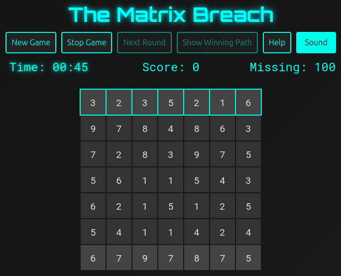
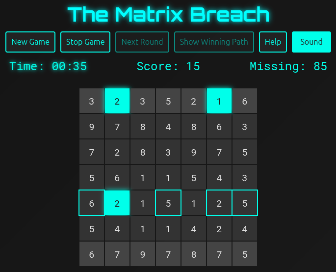
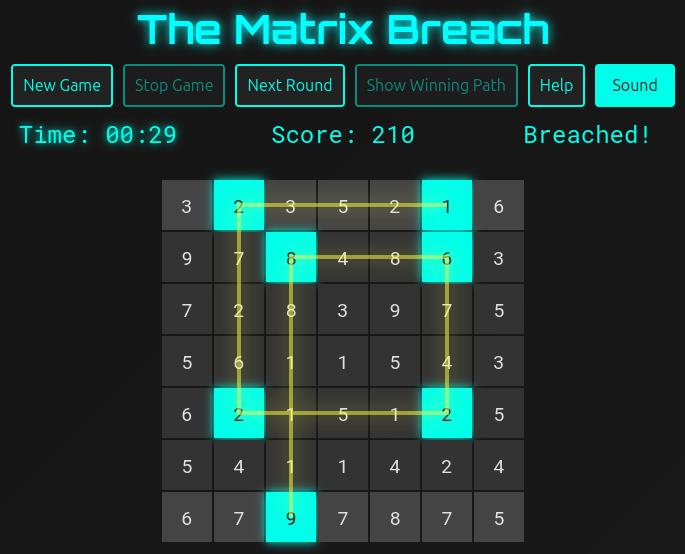
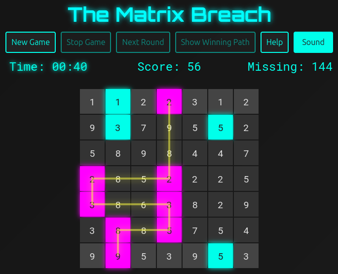

# The Hacking Game

**The Hacking Game** is a browser-based puzzle game inspired by the [Cyberpunk 2077 hacking minigame](https://cyberpunk.fandom.com/wiki/Quickhacking). You are a hacker who must breach the firewall of the system by collecting enough points on the grid. When you succeed, you move on to the next level with a higher target score.

## How to Run the Game

### Online

Visit: https://benjaminbossan.github.io/hacking-game/

### Local

1. **Download or Clone the Repository:**

`git clone https://github.com/BenjaminBossan/hacking-game.git`

Open the `index.html` file in your browser.

## Game Rules

- **Grid Setup:**
  - The board consists of a 7×7 grid. Each tile displays a number between 1 and 9.

- **Starting the Round:**
  - The **first tile** you select must be in the **top row**.

- **Making Moves:**
  - For your second move, you may choose any tile in the same row or the same column as your first choice.
  - From the third move onward, moves must **alternate**: if your previous move was **horizontal** (i.e., same row), the next move must be **vertical** (i.e., same column) and vice versa.
  - You can only select a tile with a **number equal to or higher than the number on you last selected**.

- **Round End and Scoring:**
  - The round **ends** when you select a tile in the **bottom row**.
  - Your score is calculated as **sum of selected tile numbers × length of your path**.
  - To win the round, your score must meet or exceed the current required points (shown at the bottom). After a win, the required points increase.
  - If you run out of time, have no legal moves, or the final score is too low, you lose the round.
  - If you lose, you may click **"Show Winning Path"** to view one possible solution.

## Screenshots

Start of the game:

Selecting tiles:

Game win:

If you lose, you can view the winning path:

## Developer Overview: How It Works

This game was 99% written by ChatGPT o3-mini.

### Game Flow

1. **Initialization:**
   - On clicking **"Start Game"** or **"Restart Game"**, the game resets global variables (total score, selected path, timer, etc.) and calls `startRound()`.
   - `startRound()` updates the required points display, generates a new board, attaches event listeners to tiles, highlights legal moves, and starts the timer.

2. **Board Generation:**
   - A winning sequence (a non-decreasing list of numbers) is generated using `generateWinningSequence()`. This sequence is validated to ensure that its potential score (sequence sum multiplied by its length) meets the current minimum required score.
   - The winning sequence is then laid out on the grid by a backtracking algorithm in `generateWinningPathLayout()`. This algorithm ensures:
     - The path begins in the top row.
     - The path ends in the bottom row.
     - Moves alternate between horizontal and vertical based on a randomly chosen starting direction.
   - Once the winning path is laid out, its tiles are populated with the winning sequence numbers. All other grid cells are filled with random numbers between 1 and 9.

3. **Gameplay:**
   - The player clicks on highlighted (legal) tiles to create a path.
   - The game checks the validity of moves (using `isLegalMove()`) to enforce the alternating move rule and non-decreasing number rule.
   - Legal moves are highlighted by `highlightLegalMoves()`, and the current score (displayed as “sum of tiles x length of path = total score”) updates as the player makes their selections.
   - When a tile in the bottom row is selected, or if time expires or no moves remain, the round ends.

4. **Ending a Round:**
   - If the player wins the round (score meets or exceeds the required points), the total score increases and the required points for the next round are incremented by 50.
   - If the round is lost, the game forces a restart (total score resets) but allows the player to view the winning solution by clicking **"Show Winning Path"**.

5. **Visualization:**
   - The path is visualized with both tile highlighting and an SVG overlay. The overlay draws a polyline connecting the centers of the selected tiles (or the winning path), making it easier to trace the route.

### File Structure

- **`index.html`:**
  Contains the game layout and includes references to the CSS and JS files.

- **`style.css`:**
  Defines the visual styling for the game, including the grid layout, tile styles, buttons, and SVG overlay for the path.

- **`script.js`:**
  Contains all game logic: board generation, path layout using backtracking, move validation, scoring, timer, and event handling.

---

Enjoy playing **The Hacking Game** and feel free to modify or extend its functionality as needed!
